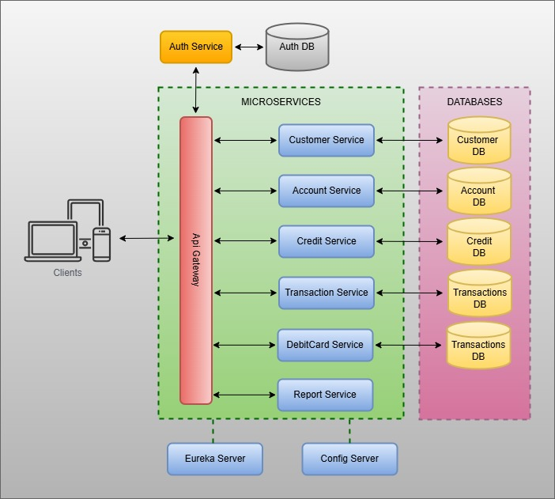

# Customer Service

## Descripción
Este microservicio gestiona todas las operaciones relacionadas con los clientes para el sistema bancario. Gestiona tanto los clientes personales como los empresariales, proporcionando operaciones CRUD y validaciones de acuerdo con las reglas de negocio.

## Arquitectura del sistema




## Tecnologías

* Java 17
* Spring Boot 3.3.5
* MongoDB
* Maven
* Lombok
* MapStruct
* OpenAPI Generator

## Características

- Gestión de clientes (particulares y empresas)
- Validación de documentos
- Gestión del estado del cliente
- Integración con otros servicios para la validación de clientes

## API Endpoints

```
POST   /api/customers          - Crear un nuevo cliente
GET    /api/customers          - Obtener todos los clientes  
GET    /api/customers/{id}     - Obtener cliente por ID
PUT    /api/customers/{id}     - Actualizar cliente
DELETE /api/customers/{id}     - Eliminar cliente
```

## Prerequisitos

* JDK 17
* MongoDB

## Documentación API 
Acceda a la documentación de OpenAPI en:

`url`: http://localhost:8585/swagger-ui.html
