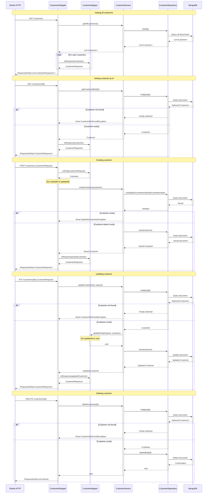

## DIAGRAMAS DE SECUENCIA

```mermaid
sequenceDiagram
    participant C as Cliente HTTP
    participant CD as CustomerDelegate
    participant CM as CustomerMapper
    participant CS as CustomerService
    participant CR as CustomerRepository
    participant DB as MongoDB

    Note over C,DB: Getting all customers
    C->>+CD: GET /customers    
    CD->>+CS: getAllCustomers()
    CS->>+CR: findAll()
    CR->>+DB: Query all documents
    DB-->>-CR: List<Customer>
    CR-->>-CS: List<Customer>
    CS-->>-CD: List<Customer>
    
    loop For each customer
        CD->>+CM: toResponse(customer)
        CM-->>-CD: CustomerResponse
    end
    
    CD-->>-C: ResponseEntity<List<CustomerResponse>>

    Note over C,DB: Getting customer by id

    C->>+CD: GET /customers/{id}    
    
    CD->>+CS: getCustomerById(id)
    CS->>+CR: findById(id)
    CR->>+DB: Query document
    DB-->>-CR: Optional<Customer>
    
    alt Customer not found
        CR-->>CS: Empty Optional
        CS-->>CD: throw CustomerNotFoundException
    else Customer exists
        CR-->>-CS: Customer
        CS-->>-CD: Customer
        
        CD->>+CM: toResponse(customer)
        CM-->>-CD: CustomerResponse
        
        CD-->>-C: ResponseEntity<CustomerResponse>
    end
    
    Note over C,DB: Creating customer

    C->>+CD: POST /customers (CustomerRequest)
    
    CD->>+CM: toEntity(customerRequest)
    CM-->>-CD: Customer
    
    Note over CD: Set createdAt & updatedAt
    
    CD->>+CS: createCustomer(customer)
    
    CS->>+CR: existsByDocumentNumber(documentNumber)
    CR->>+DB: Query document
    DB-->>-CR: Result
    CR-->>-CS: boolean
    
    alt Customer exists
        CS-->>CD: throw DuplicateCustomerException
    else Customer doesn't exist
        CS->>+CR: save(customer)
        CR->>+DB: Insert document
        DB-->>-CR: Saved document
        CR-->>-CS: Saved Customer
        CS-->>-CD: Saved Customer
        
        CD->>+CM: toResponse(savedCustomer)
        CM-->>-CD: CustomerResponse
        
        CD-->>-C: ResponseEntity<CustomerResponse>
    end

    Note over C,DB: Updating customer

    C->>+CD: PUT /customers/{id} (CustomerRequest)
    
    CD->>+CS: updateCustomer(id, request)
    CS->>+CR: findById(id)
    CR->>+DB: Query document
    DB-->>-CR: Optional<Customer>
    
    alt Customer not found
        CR-->>CS: Empty Optional
        CS-->>CD: throw CustomerNotFoundException
    else Customer exists
        CR-->>-CS: Customer
        
        CS->>+CM: updateEntity(request, customer)
        Note over CM: Set updatedAt to now
        CM-->>-CS: void
        
        CS->>+CR: save(customer)
        CR->>+DB: Update document
        DB-->>-CR: Updated Customer
        CR-->>-CS: Updated Customer
        CS-->>-CD: Updated Customer
        
        CD->>+CM: toResponse(updatedCustomer)
        CM-->>-CD: CustomerResponse
        
        CD-->>-C: ResponseEntity<CustomerResponse>
    end

    Note over C,DB: Deleting customer

    C->>+CD: DELETE /customers/{id}
    
    CD->>+CS: deleteCustomer(id)
    CS->>+CR: findById(id)
    CR->>+DB: Query document
    DB-->>-CR: Optional<Customer>
    
    alt Customer not found
        CR-->>CS: Empty Optional
        CS-->>CD: throw CustomerNotFoundException
    else Customer exists
        CR-->>-CS: Customer
        
        CS->>+CR: deleteById(id)
        CR->>+DB: Delete document
        DB-->>-CR: Confirmation
        CR-->>-CS: void
        CS-->>-CD: void
        
        CD-->>-C: ResponseEntity.noContent()
    end

```
